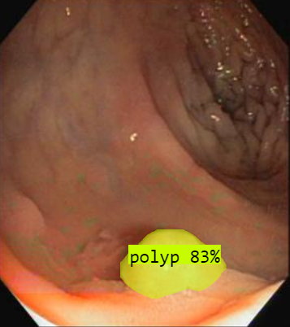

# Detection Models with YOLO

Welcome to the Detection Models repository, where we leverage the power of YOLO (You Only Look Once) to create efficient and fast object detection models. Our key focus areas include the development and deployment of models for face mask detection and fire detection, essential for safety and health in various environments.

## Some Results:





## Models Overview

- **Fire Detector**: A critical model for early fire detection, designed to identify fire in real-time video feeds, potentially saving lives and property by allowing for quick response.

- **Polyp Detector**: Utilizing a YOLO segmentation model, our solution swiftly identifies polyps in medical images like colonoscopy videos. This enhances early diagnosis and treatment of colorectal conditions, ensuring improved patient outcomes.

- **Face Mask Detector**: Designed to identify whether individuals in the camera's view are wearing face masks. This model plays a crucial role in monitoring public health protocols.

- **Leaf Disease Detector**: Analyzes leaf images to diagnose plant diseases, helping in agriculture to protect crops.
- **Awake or Asleep Detector**:Determines whether a person is awake or asleep, useful in monitoring driver alertness or studying sleep patterns.
- **Pothole Detector**: Identifies potholes on roads from images or video feeds, assisting in road maintenance and safety.

- **Number Plate Digits Detector**: Recognizes and extracts digits from vehicle number plates, used in traffic management and law enforcement.
- **Tennis Ball Detector**: Detects tennis balls within a video feed, useful for automated sports analysis and broadcasting.
- **Vehicle and Person Detector**: Identifies vehicles and people in video feeds, used for surveillance, traffic monitoring, and safety systems.

## Using the Deployed Models

We have deployed our models to make them easily accessible for inference. Please sign in to Roboflow and follow the links below and test the model out by just uploading an image,video or realtime webcam:

- [Fire Detector](https://universe.roboflow.com/vision-zz6rk/fire_detector-g4lir/model/7) - Link to deployed model!

- [Polyp Segmentation](https://universe.roboflow.com/pavan-cs-q3hq0/polpy-twuhz/model/4) - Link to deployed model!

- [Face Mask Detector](https://universe.roboflow.com/wce-cmtzh/face_mask_detector-fhj36/model/3) - Link to deployed model!

## Getting Started

To get started with our models, please follow the instructions below. We have deployed our models for easy access and inference.

### Requirements

- Python 3.6 or later
- PyTorch (The installation command below will install it if not already installed)
- Ultralytics

### Pip Install Method (Recommended)

To install the necessary packages, run the following command in your Python environment:

```bash
pip install torch ultralytics==8.0.196
```

## Getting Started

Quick start for training and testing:

[](https://colab.research.google.com/drive/1LivJRxLtOFb4fsJ7NAvJtoAVaEuVw8dM?usp=sharing)

To get started with testing the detection models, follow the steps below:

1. **Clone the Repository:**

```bash
git clone https://github.com/pavan98765/Detection_Models.git
```

2. Open [Testing_and_evaluation.ipynb](Code/Testing_and_evaluation.ipynb) notebook to test the model on images, visulaize them and to realtime predictions through webcam!

3. Please open the [training_notebook.ipynb](Code/Training.py) to download the dataset from roboflow and start training the Model. You can choose different sizes(variations) of the model like nano,small, medium, large and xl. After the training is done you can evaluate and predict with the model.

## Contributing

We welcome contributions to the Detection project! Whether it's through improving the model's accuracy,or expanding the dataset, your help is invaluable. If you encounter any problems or have suggestions, please feel free to open an issue or submit a pull request.

Thank you for your interest in our project.
